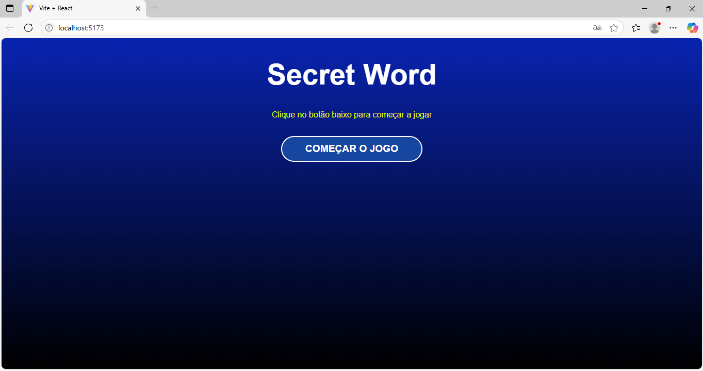
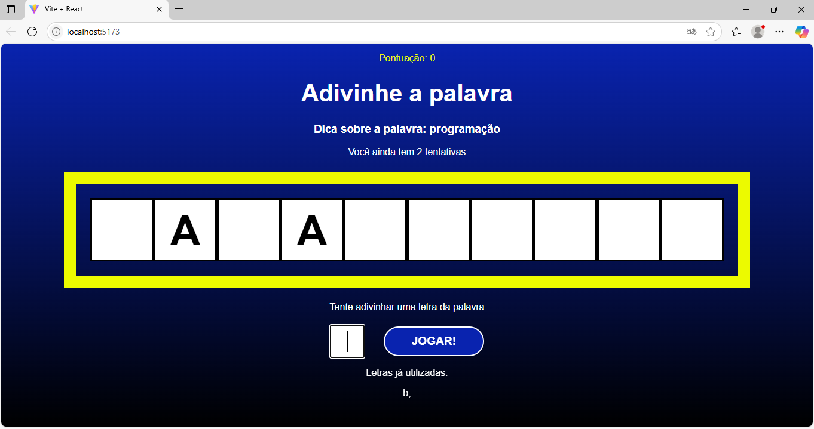
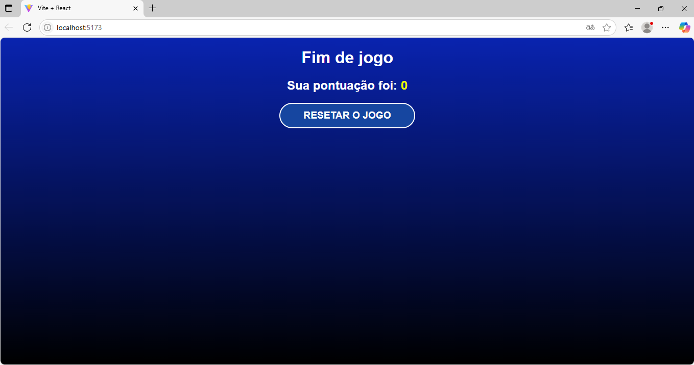

# 🎯 SecretWord – Jogo da Palavra Secreta

  

**SecretWord** é um jogo web divertido e interativo onde você precisa adivinhar a palavra secreta antes que suas chances acabem. A cada palavra correta, você ganha pontos e avança no jogo!

Este projeto foi desenvolvido com **React + JavaScript** como parte do meu aprendizado prático para reforçar conceitos essenciais de desenvolvimento front-end com **React**.

> **Adicione mais palavras!**  
> A proposta desse projeto é simples.  
> Como banco de dados de palavras, utilizamos um arquivo `words.js`.  
> Você pode adicionar mais palavras nele, ele se encontra em:  
> `\SecretWord\secretword\src\data\words.js`


---

## 🕹️ Como funciona o jogo?

- Você terá um número limitado de tentativas para acertar a palavra secreta.
- A cada letra correta, ela é revelada na palavra.
- Ao acertar a palavra, você marca pontos e recebe uma nova palavra!
- O jogo continua até que suas chances acabem.


## 📸 Capturas de Tela

Adicione aqui os prints da tela do jogo em execução para mostrar o visual da aplicação:

```md





---

## 🚀 Tecnologias utilizadas

- ⚛️ **React** (com Vite)
- 🟨 **JavaScript (ES6+)**
- 💅 **CSS Modules** para estilização
- 📦 **Vite** como bundler

---

## 📦 Como executar o projeto

1. Clone o repositório:
   ```bash
   git clone https://github.com/seu-usuario/secretword.git
   cd secretword   
   npm run dev


---

## ✍️ Autor

Desenvolvido com 💙 por **[Klaus Christian Kurth](https://github.com/klausckurth)**  
📧 klausckurth@gmail.com  
🔗 [LinkedIn](https://www.linkedin.com/in/klauskurth/) 